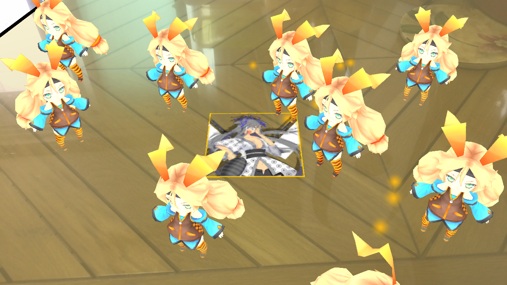

# Unity-ARFoundation-Sample

AR Foundation을 이용해서 지뢰찾기 만들기 프로젝트

## 작업 환경

- Unity `2019.1.4f1`
- AR Foundation `2.1.0-preview3`
- ARCore XR Plugin `2.1.0-preview5`
- ARKit XR Plugin `2.1.0-preview5`

## 샘플 프로젝트 

- 현실세계의 표면을 인식한 다음, 레이트레이싱을 이용하여 표면 인디케이터 위에 유니티짱 오브젝트 생성
- [레퍼런스](https://www.youtube.com/watch?v=Ml2UakwRxjk)

- 작동영상

